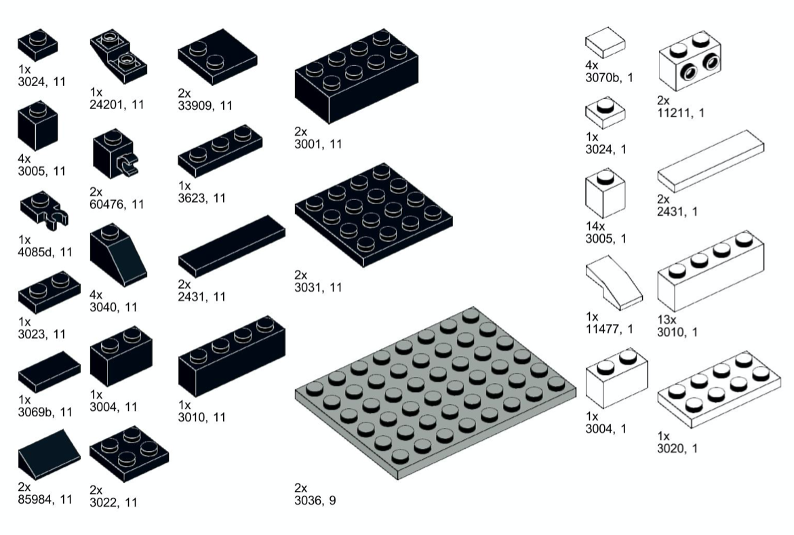
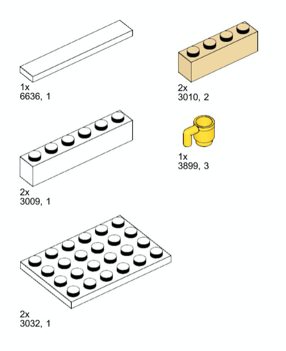
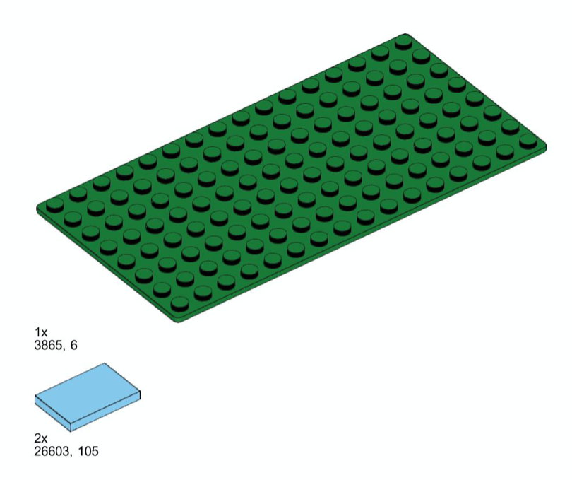

# GitHub LEGO Sets

A collection of reverse engineered LEGO sets created by GitHub as swag.

## The set

| Front                                                                                                                      | Back                                                                                                                     |
|----------------------------------------------------------------------------------------------------------------------------|--------------------------------------------------------------------------------------------------------------------------|
|  |  |

## Instructions

The instructions for the LEGO set can be found in the [github-summit2021.pdf](./Summit2021/github-summit2021.pdf).

## The bricks

In order to get you started, you first need to have the following bricks:

### Bricklink

In case you want to buy all bricks at once, you can use the following XML for creating your wanted list in Bricklink: [github-summit2021.xml](./Summit2021/github-summit2021.xml).
