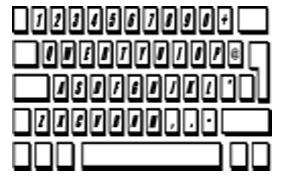
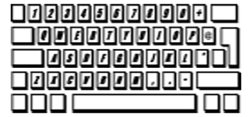

# GitHub LEGO Sets

A collection of reverse engineered LEGO sets created by GitHub as swag.

## The set

| Front | Back |
| ---- |---- |
|  |  |

## Instructions

The instructions for the LEGO set can be found in the [github-summit2021.pdf](./Summit2021/github-summit2021.pdf).

## The bricks

In order to get you started, you first need to have the following bricks:

### Bricklink

In case you want to buy all bricks at once, you can use the following XML for creating your wanted list in Bricklink: [github-summit2021.xml](./Summit2021/github-summit2021.xml).

## Stickers

In the [assets](./Summit2021/assets) folder, you'll find various images you can use to print your own stickers.

### Body dimensions

| Width | Height | Source |
| ---- | ---- | ---- |
| 14mm | 17mm | [Body assets](./Summit2021/assets/body) |

### Decoration dimensions

| Width | Height | Source | Info |
| ---- | ---- | ---- | ---- |
| 22mm | 14mm |  | 2x3 brick |
| 30mm | 14mm |  | 2x4 brick |

### Face dimensions

| Width | Height | Source |
| ---- | ---- | ---- |
| 30mm | 18mm | [Face assets](./Summit2021/assets/faces) |

### Screen dimensions

| Width | Height | Source |
| ---- | ---- | ---- |
| 30mm | 22mm | [Screen assets](./Summit2021/assets/screens) |
